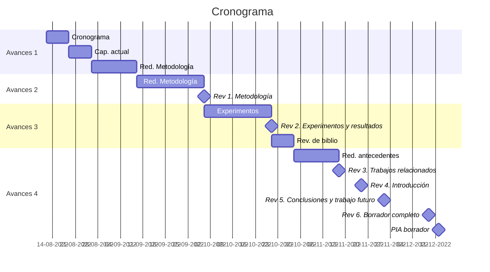

# Tarea 1. Cronograma

```mermaid
gantt
    title Cronograma
    dateFormat  DD-MM-YYYY
    axisFormat  %d-%m-%Y
    section Avances 1
        Cronograma              :a11, 12-08-2022, 19-08-2022
        Cap. actual             :a12, 19-08-2022, 26-08-2022
        Red. Metodología        :a13, 26-08-2022, 09-09-2022
    section Avances 2
        Red. Metodología   :a21, 09-09-2022, 30-09-2022
        Rev 1. Metodología : milestone, m1, 30-09-2022,30-09-2022
    section Avances 3
        Experimentos             :a31, 30-09-2022, 21-10-2022
        Rev 2. Experimentos y resultados : milestone, m2, 21-10-2022,21-10-2022
        Rev. de biblio     :a34, 21-10-2022, 28-10-2022
    section Avances 4
        Red. antecedentes        :a41, 28-10-2022, 11-11-2022
        Rev 3. Trabajos relacionados : milestone, m3, 11-11-2022,11-11-2022
    Rev 4. Introducción : milestone, m3, 18-11-2022,18-11-2022
    Rev 5. Conclusiones y trabajo futuro : milestone, m3, 25-11-2022,25-11-2022
    Rev 6. Borrador completo : milestone, m3, 09-12-2022,09-12-2022
    PIA borrador : milestone, m3, 12-12-2022,12-12-2022
```